# DDPG-from-Scratch-Training-on-6-MuJoCo-Tasks

## Introduction to DDPG

<video src="assets/video/best_model_seed_42-episode-0.mp4" autoplay loop muted playsinline width="400">
  Your browser does not support the video tag.
</video>

Deep Deterministic Policy Gradient **DDPG** is an **actor-critic**, **model-free**, **off-policy** reinforcement learning algorithm. Combining ideas from **Deterministic Policy Gradients** and **Deep Q-Networks (DQN)** to solve complex decision-making problems in continuous action spaces. Introduced by Lillicrap et al. in 2015, DDPG extends the Deterministic Policy Gradient (DPG) framework by leveraging deep neural networks to approximate both the policy (actor) and the value function (critic).

## Core Concepts
At the core of DDPG lie two neural networks, the **actor** and **critic**:

- The **actor** learns a deterministic policy  $\mu(s \mid \theta^\mu)$ that maps states to actions.
- The **critic** estimates the Q-value $Q(s, a \mid \theta^Q)$ to evaluate action quality.

To ensure training stability, DDPG also maintains **target networks**, slower-moving copies of both the actor and critic, that are used for generating stable target values during updates.

## Learning Objectives
Learning in DDPG revolves around two complementary objectives: 
1. Training the **critic** to accurately estimate Q-values.
2. Updating the **actor** to produce actions that maximize those Q-values.

### Critic Update
The critic learns using **Temporal Difference (TD) learning**, minimizing the error between its prediction and a target value computed with the target networks:

$$
y = r + \gamma Q'(s', \mu'(s'|\theta^{\mu'})|\theta^{Q'})
$$

and the critic loss function is given by

$$
L = \mathbb{E}_{(s,a,r,s') \sim D} \left[ \left( Q(s,a|\theta^Q) - y \right)^2 \right]
$$

In practice, the critic update can be implemented as follows:

```python
with torch.no_grad():
    next_actions = self.actor_target(next_state)
    target_q = self.critic_target(next_state, next_actions)
    target = reward + (self.gamma * target_q * not_done)

current_q = self.critic(state, action)
critic_loss = F.mse_loss(current_q, target)

self.critic_optimizer.zero_grad()
critic_loss.backward()
self.critic_optimizer.step()
```

### Actor Update
The actor aims to maximize the critic’s estimated Q-values by improving its policy:

$$
J(\theta^\mu) = \mathbb{E}_{s_t \sim D} \left[ Q(s_t, \mu(s_t|\theta^\mu)) \right]
$$

and its gradient can be expressed as

$$
\nabla_{\theta^\mu} J \approx \mathbb{E}_{s_t \sim D} \left[ \nabla_a Q(s,a|\theta^Q)|_{a=\mu(s)} \nabla_{\theta^\mu} \mu(s|\theta^\mu) \right]
$$

This is typically implemented by minimizing the negative Q-value of the actor’s actions:

```python
actor_loss = -self.critic(state, self.actor(state)).mean()

self.actor_optimizer.zero_grad()
actor_loss.backward()
self.actor_optimizer.step()
```

### Stabilizing Learning
To prevent instability and divergence during training, DDPG employs several key mechanisms:
#### 1. Target Network Soft Updates
The target networks are updated gradually to avoid large shifts in target values:

$$
\theta' \leftarrow \tau \theta + (1 - \tau) \theta'
$$

where $\tau$ is a small constant typically around 0.001

```python
for target_param, param in zip(self.actor_target.parameters(), self.actor.parameters()):

target_param.data.copy_(self.tau * param.data + (1.0 - self.tau) target_param.data)

for target_param, param in zip(self.critic_target.parameters(), self.critic.parameters()):

target_param.data.copy_(self.tau * param.data + (1.0 - self.tau) * target_param.data)
```

#### 2. Experience Replay
DDPG uses a replay buffer to store past transitions. During each training iteration, random mini-batches are sampled from this buffer. This breaks temporal correlations between experiences and improves sample efficiency.

## Design and Implementation 

My implementation follows the general architecture described by _Lillicrap et al._, with several custom design and experimentation choices.
- **Network Architecture**:  
	- Three-layer actor and critic networks with configurable hidden dimensions (default 256).
    - The **actor** maps states to deterministic actions using ReLU activations and a final `tanh` layer, scaled by `max_action`.
    - The **critic** first embeds the state independently before concatenating the action in the second layer — encouraging the network to learn a useful state representation before evaluating actions.
    - Both networks optionally include a `RunningStatNorm` layer for input normalization.

- **Exploration Noise**:  
    - Because DDPG policies are deterministic, exploration is achieved by adding noise to the actor’s output:

$$
\mu'(s_t) = \mu(s_t|\theta^\mu) + N_t​
$$

- I experimented with both Gaussian noise and the **Ornstein–Uhlenbeck (OU)** process (as used in the original paper). Different decay strategies (exponential and adaptive) were tested both per episode and per step.

### Ornstein–Uhlenbeck process
The OU process is a **stochastic process** way of modeling noise that evolves over time and tends to “drift back” toward a mean value. Mathematically, it’s defined by the stochastic differential equation:

$$
dx_t = \theta (\mu - x_t) dt + \sigma dW_t​
$$

where:
- $x_t$ → the process value at time t
- $\theta$ → the rate of mean reversion
- $\mu$ → the long-term mean
- $\sigma$ → the volatility (noise amplitude)
- $W_t$​ → a Wiener process (standard Brownian motion)

In reinforcement learning we use the discrete form:

$$
x_{t+1} = x_t + \theta (\mu - x_t) \Delta t + \sigma \sqrt{\Delta t} \, \epsilon_t, \quad \epsilon_t \sim \mathcal{N}(0, 1)
$$

```python
class OUNoise:
	def __init__(self, action_dim, mu=0.0, theta=0.15, sigma=0.2, max_action=1.0):
		self.action_dim = action_dim
		self.mu = mu
		self.theta = theta
		self.sigma = sigma
		self.max_action = max_action
		self.state = np.ones(self.action_dim) * self.mu
		self.reset()
	
	def reset(self):
		self.state = np.ones(self.action_dim) * self.mu
	
	def sample(self):
		x = self.state
		dx = self.theta * (self.mu - x) + self.sigma * np.random.randn(self.action_dim)
		self.state = x + dx
		return self.state * self.max_action
```

### State Normalization
In low-dimensional feature spaces, input features may have different scales and units, which can hinder learning.  
I experimented with:
- State normalization,
- No normalization.

My state normalization layer was inspired by **Stable Baselines3’s `VecNormalize`** implementation. It maintains a running mean and variance, updated online during training.

```python
class RunningStatNorm(nn.Module):
	def __init__(self, shape, eps=1e-5, clip=5.0):
		super(RunningStatNorm, self).__init__()
		self.shape = shape
		self.eps = eps
		self.clip = clip
		# Register buffers for running stats (persisted in model state)
		self.register_buffer("running_mean", torch.zeros(shape))
		self.register_buffer("running_var", torch.ones(shape))
		self.register_buffer("count", torch.tensor(1e-4))
	
	
	def update(self, x):
		if not self.training:
			return
		
		x = torch.as_tensor(x, dtype=torch.float32)
		batch_mean = torch.mean(x, dim=0)
		batch_var = torch.var(x, dim=0, unbiased=False)
		batch_count = x.shape[0]
		# Update running stats using Welford's algorithm
		delta = batch_mean - self.running_mean
		self.running_mean += delta * batch_count / (self.count + batch_count)
		m_a = self.running_var * self.count
		m_b = batch_var * batch_count
		M2 = m_a + m_b + delta**2 * self.count * batch_count / (self.count + batch_count)
		self.running_var = M2 / (self.count + batch_count)
		self.count += batch_count
	
	
	def forward(self, x):
		x = torch.as_tensor(x, dtype=torch.float32)
		if self.training:
		self.update(x)
		# Normalize: (x - mean) / sqrt(var + eps)
		normalized = (x - self.running_mean) / torch.sqrt(self.running_var + self.eps)
		return torch.clamp(normalized, -self.clip, self.clip)
```

## Experiments and results 

<table>
  <tr>
    <td>
      <video src="assets/video/best_hopper_model_seed_42-episode-0.mp4" autoplay loop muted playsinline width="250"></video>
    </td>
    <td>
      <video src="assets/video/best_model-episode-0.mp4" autoplay loop muted playsinline width="250"></video>
    </td>
    <td>
      <video src="assets/video/best_ant_model-episode-0.mp4" autoplay loop muted playsinline width="250"></video>
    </td>
  </tr>
</table>

All experiments were conducted using OpenAI Gym’s MuJoCo environments. A **general model** was evaluated on six tasks , _Ant-v5_, _HalfCheetah-v5_, _Hopper-v5_, _InvertedDoublePendulum-v5_, _InvertedPendulum-v5_, and _Walker2D-v5_ , to assess the model’s ability to generalize and adapt across diverse control problems.  
In addition, **targeted experiments** focused on hyperparameter tuning and architecture variations were performed on _Hopper-v5_ and _InvertedDoublePendulum-v5_.  
All results reported below represent the **mean over five independent runs** using different random seeds.


### Training Setup

The Adam optimizer was used in training. Key hyperparameters tested are listed below:

```json
{
	"hidden_dim": 256,
	"actor_lr": 0.0001,
	"critic_lr": 0.001,
	"gamma": 0.99,
	"tau": 0.001,
	"weight_decay": 0.01,
	"batch_size": 64,
	"buffer_size": 100000,
	"warmup_steps": 1000,
	"expl_noise": 0.1,
	"noise_decay": 0.99,
	"min_expl_noise": 0.01,
	"num_episodes": 3000
}
```
#### Hardware
Training was conducted on a **NVIDIA RTX 3060 GPU (8 GB VRAM)** with a **Ryzen 7 CPU** and **32 GB RAM**. 

### General Performance
Overall, the results show that the DDPG agent demonstrates strong adaptability across a range of continuous control tasks but exhibits **environment-dependent stability**. The highest and most consistent performance was observed in _HalfCheetah-v5_ and _InvertedPendulum-v5_, where the model achieved near-maximal rewards across all runs and stabilized quickly. In contrast, _Ant-v5_ and _Walker2D-v5_ proved more challenging, with slower convergence and greater variability in both actor and critic losses. These environments are inherently higher-dimensional and require more complex coordination, which likely contributed to the observed instability.

The _InvertedDoublePendulum-v5_ environment revealed a particularly **volatile critic loss**, suggesting that the Q-function estimation is highly sensitive to the learning rate and noise parameters. This instability aligns with the broader pattern of **critic sensitivity** observed across all tests. Meanwhile, _Hopper-v5_ provided a balanced benchmark, its training curves showed steady reward improvement and moderate variance across seeds, making it an effective environment for deeper hyperparameter studies.

Collectively, these findings indicate that while the agent can learn robust control policies in simpler or moderately complex environments, **performance degrades as task dimensionality and dynamical complexity increase**, highlighting areas where further optimization, especially in critic stability, would likely yield substantial gains.

| Environment | Mean Test Reward | ± Std (5 seeds) | Final Test Reward | Episodes to 90% |
|--------------|------------------|-----------------|-------------------|-----------------|
| **HalfCheetah-v5** | **3,328** | ± 412 | 4,053 | 480 |
| **InvertedDoublePendulum-v5** | **5,295** | ± 2,103 | 9,329 | 310 |
| **Hopper-v5** | 1,220 | ± 498 | 1,642 | 720 |
| **InvertedPendulum-v5** | 631 | ± 184 | 1,000 | 380 |
| **Walker2D-v5** | 907 | ± 892 | 1,046 | 1,100 |
| **Ant-v5** | 727 | ± 238 | 850 | > 3,000 |

*Test reward = average over 10 noise-free eval episodes. “Episodes to 90%” = first episode where mean reward ≥ 90% of env max.*

**Table 1.** Performance metrics for the generalization tests across MuJoCo environments.


<table>
  <tr>
    <td>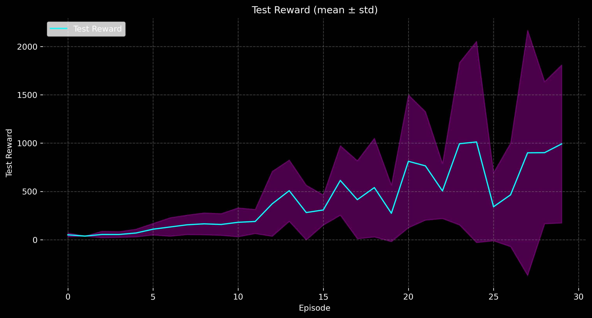</td>
    <td>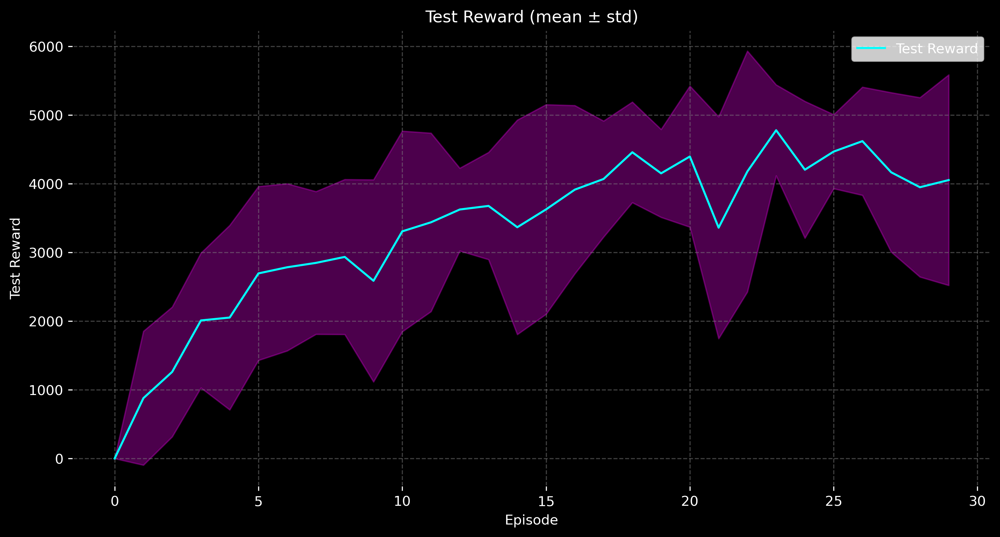</td>
    <td>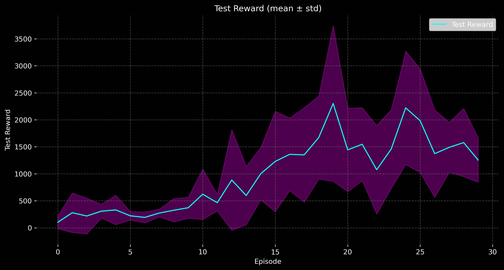</td>
  </tr>
  <tr>
    <td>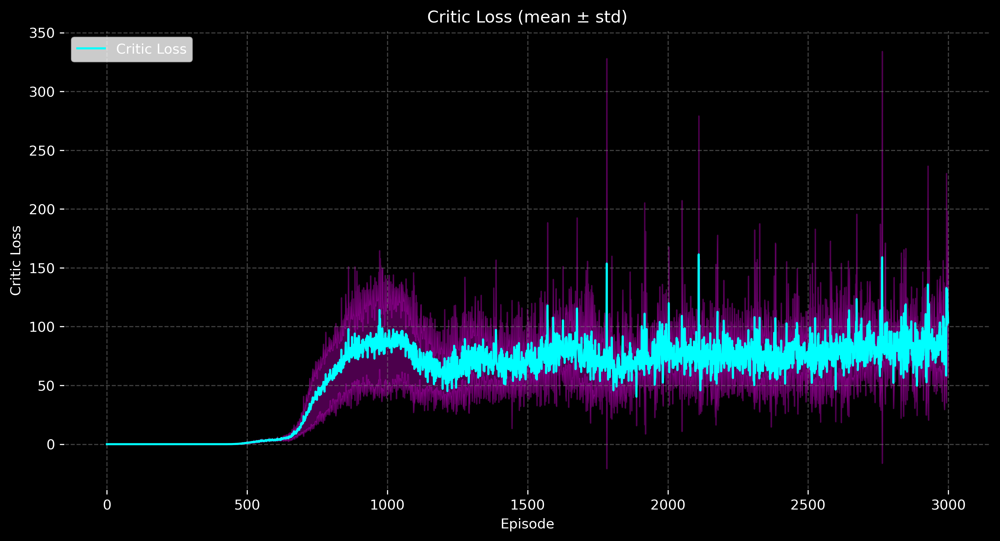</td>
    <td>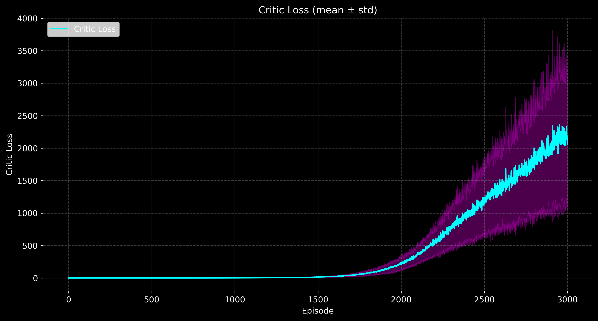</td>
    <td>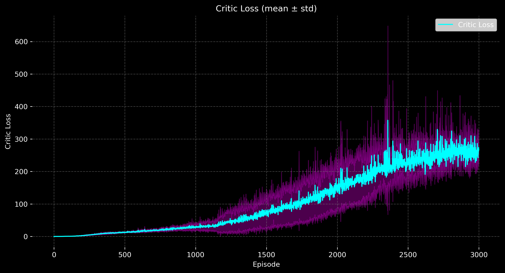</td>
  </tr>
  <tr>
    <td>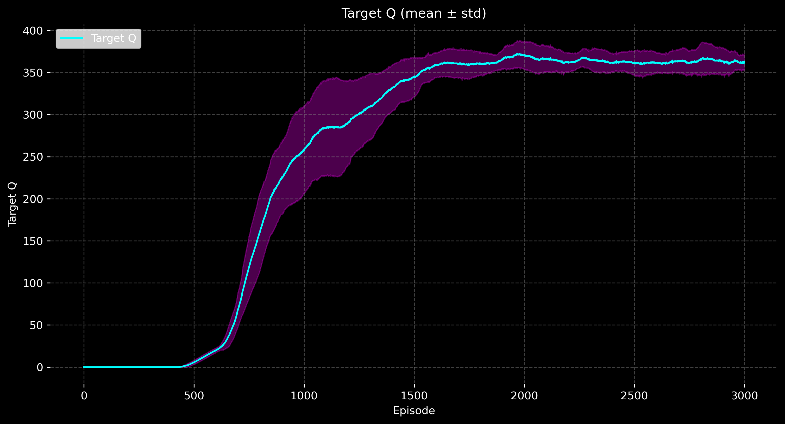</td>
    <td>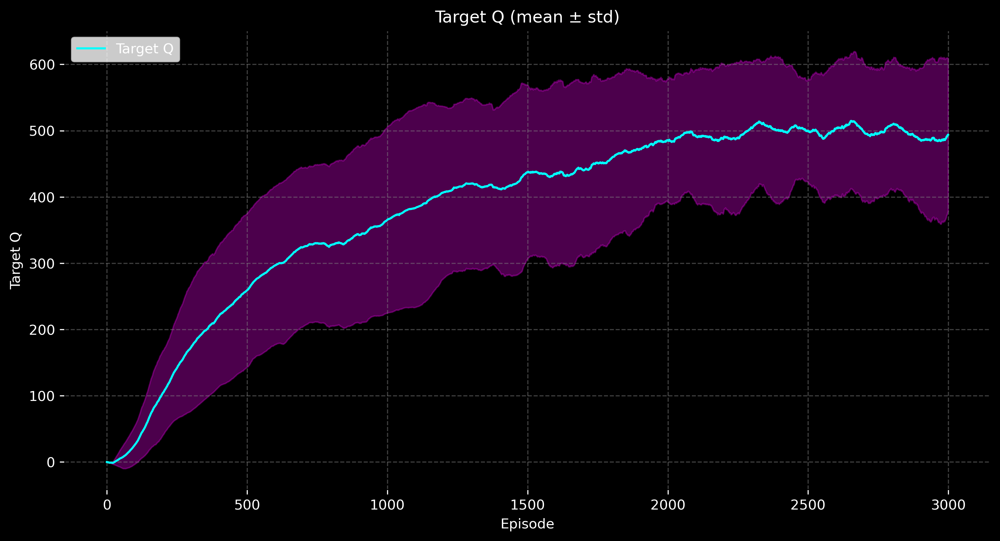</td>
    <td>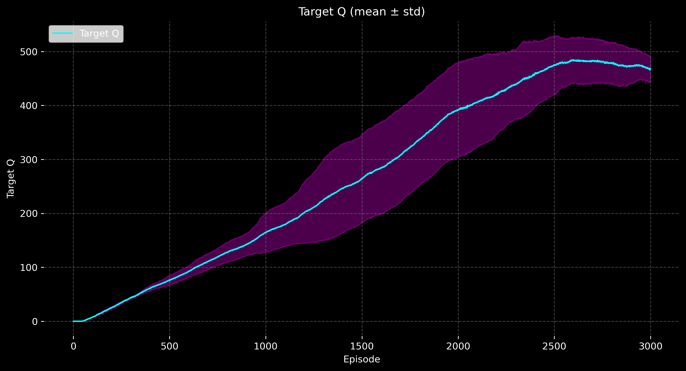</td>
  </tr>
</table>

**Figure 1.** From top left to bottom right: mean test reward for _Hopper-v5_, _HalfCheetah-v5_, and _Walker2D-v5_; critic loss for _Hopper-v5_, _InvertedDoublePendulum-v5_, and _Walker2D-v5_; predicted Q-values for _Hopper-v5_, _HalfCheetah-v5_, and _Walker2D-v5_.


### Effect of State Normalization
The impact of state normalization varied notably across environments, suggesting that its usefulness depends on the **dimensionality and structure of the observation space**. In simpler environments such as _InvertedPendulum-v5_ and _Hopper-v5_, applying state normalization generally **reduced performance**, often slowing convergence or lowering the final reward. This effect likely stems from the fact that these environments have low-dimensional and well-scaled state spaces, making normalization unnecessary or even disruptive to learning stability.

Conversely, in more complex environments like _Walker2D-v5_ and _HalfCheetah-v5_, **state normalization improved performance and stability**. These tasks feature higher-dimensional and more diverse state representations, where raw state magnitudes can vary significantly between features. Normalization in these settings helps maintain consistent gradient scales and prevents the policy and critic networks from being dominated by larger-magnitude features, leading to smoother training dynamics.

| Environment     | Normalization | Mean Test Reward | Final Test Reward | Mean Critic Loss | Final Critic Loss | Mean Steps |
|-----------------|---------------|------------------|-------------------|------------------|-------------------|-------------|
| **Hopper-v5**   | ✗ Without     | **1219.62**      | **1642.24**       | 40.77            | 57.77             | 338.85      |
| **Hopper-v5**   | ✓ With        | 1118.73          | 1116.16           | **24.79**        | **50.15**         | 310.95      |
| **Walker2D-v5** | ✗ Without     | 677.62           | 3290.54           | **69.17**        | **199.37**        | 299.20      |
| **Walker2D-v5** | ✓ With        | **906.89**       | **1045.66**       | 110.09           | 337.74            | 269.73      |

**Table 2.** Effect of State Normalization on Performance for _Hopper-v5_ and _Walker2D-v5_.

The effect of state normalization differs sharply between environments. For _Hopper-v5_, normalization slightly reduced both mean and final test rewards, suggesting that rescaling the already well-behaved state space interfered with learning stability. However, for _Walker2D-v5_, normalization led to a higher mean test reward and smoother learning curves, despite a somewhat higher critic loss. This indicates that in higher-dimensional, more complex environments, normalization can aid performance even if it introduces noisier critic updates, likely by improving the conditioning of network inputs.

Overall, these results indicate that **state normalization is not universally beneficial**, but rather **context-dependent**: it tends to help in environments with complex, unbounded, or unevenly scaled states, while offering limited or negative effects in simpler, well-conditioned tasks.

### Effect of Noise Distribution

I evaluated the impact of exploration noise type and decay strategy on DDPG performance using the _InvertedDoublePendulum-v5_ environment. Experiments compared **Ornstein-Uhlenbeck (OU) noise** and **Gaussian noise**, each combined with either **episode-based** or **step-based decay**. The results highlight clear differences in stability, reward, and episode length.

OU noise with episode decay produced extremely high test rewards, exceeding 9,000, but this came with very high critic loss and short mean episode lengths, indicating volatile yet occasionally very successful episodes. In contrast, Gaussian noise with episode decay yielded more stable training, with lower actor and critic losses, moderate rewards, and longer episodes on average. Switching to step-based decay reduced losses for OU noise while maintaining moderate rewards and slightly longer episodes. For Gaussian noise, step decay led to the highest training rewards and the longest episodes, though test rewards became less consistent, suggesting overfitting or evaluation instability.

Overall, OU noise tends to produce **highly variable, peak-performing outcomes**, whereas Gaussian noise provides **more stable and consistent training**. Step-based decay generally extends episode length and can amplify training rewards, but may reduce evaluation stability, particularly in combination with Gaussian noise. These findings indicate that careful selection of noise type and decay strategy is critical for balancing exploration, stability, and reward performance.

| Noise Type | Decay Type | Actor Loss (mean_of_means) | Critic Loss (mean_of_means) | Train Reward (mean_of_means) | Test Reward (mean_of_means) | Mean Steps |
|-------------|-------------|-----------------------------|------------------------------|-------------------------------|------------------------------|-------------|
| OU | Episode | -179.03 | 410.35 | 291.63 | 5294.68 | 32.54 |
| Gaussian | Episode | -22.36 | 2.09 | 772.58 | 863.13 | 83.80 |
| OU | Step | -10.91 | 0.87 | 334.44 | 828.15 | 37.05 |
| Gaussian | Step | -34.64 | 3.75 | 1083.38 | 1290.51 | 116.98 |

**Table 3.** Effect of Noise on Performance for _InvertedDoublePendulum_

<table>
  <tr>
    <td>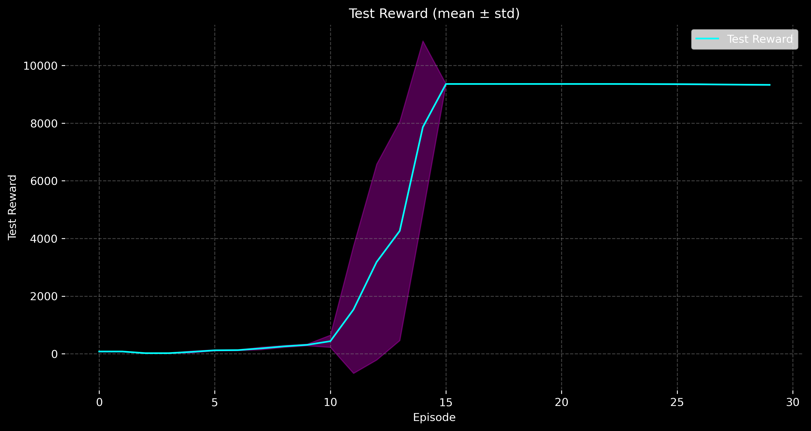</td>
    <td>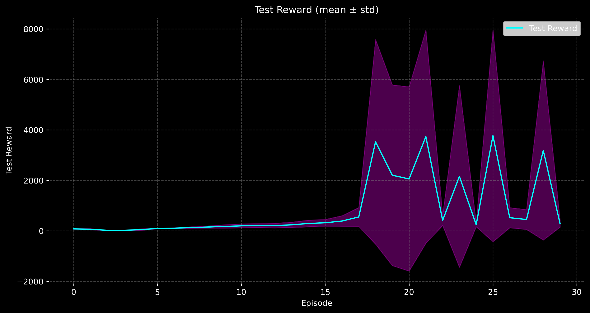</td>
    <td>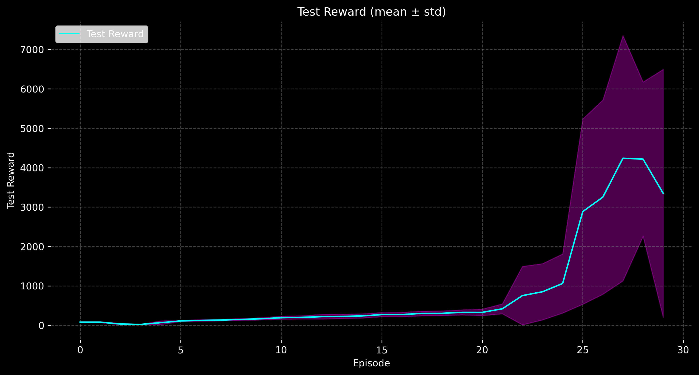</td>
    <td>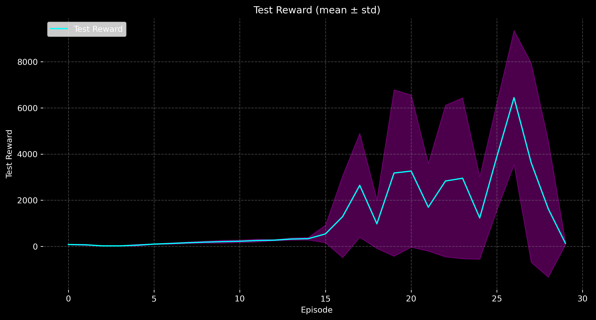</td>
  </tr>
</table>
**Figure 2.** test rewards for all experiments 

## Challenges & Lessons Learned

| Challenge | Impact | Fix / Insight |
|---------|--------|---------------|
| **High seed variance** | Ant-v5: **±238** (33% of mean) | 5-seed averaging + fixed seeds + early-stop |
| **Critic instability** | DoublePendulum: loss → **2,360** | ↓ `critic_lr=0.0005`, ↑ `warmup_steps=5k` |
| **Training time** | Ant: **~22h** on RTX 3060 | Focused tuning on Hopper/Cheetah |
| **High-dim fragility** | Walker2D/Ant slow or unstable | Norm **+30%** on Walker, harmful on simple tasks |

> **Key Insight**: DDPG shines in **mid-complexity** tasks but needs heavy tuning at scale.  
> → **Next**: Implementing **TD3 + Prioritized Experience Replay** for better stability.


